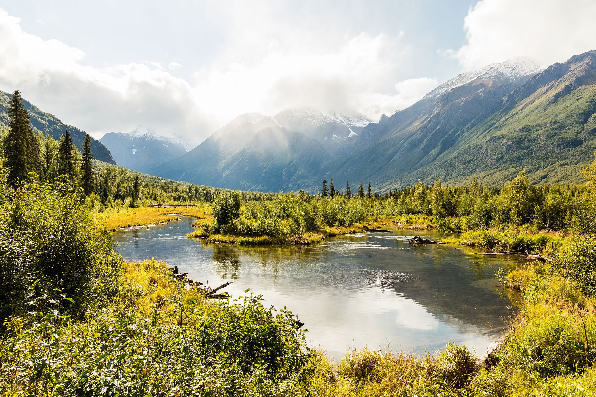

# DICKINSON CLIMATE CLASSIFICATION

# How to run the code

To run the code, open two Earth Engine Code Editor windows.

Paste the full code of the the most up to date versions, AllVersionsTogether.js and 2100AllVersionsTogether.js seperately in New Script boxes of each of the windows.

Click the "run" button.

This will generate a current climate map and a map of the climate as it is projected to be in the year 2100 given NASA's RCP8.5 "business as usual" global warming/climate change projections.

All locations on the maps are organized and color-coded according to the Dickinson Comprehensive Climate Classification System, which is explained below in this README.

Clicking on any location of the map will result in the climate classification being shown directly below the "Click map for classification" on the bottom right.

Some of these functionalities and category displays may take some time to load.

You can also filter by climate codes using the bottom right dropdown menu.

A graph to the top right displays selected cities, organized by climate classification.

Anyone with a basic knowledge of programming could make their own versions of the code by editing to add more cities to the cityList that is displayed in this graph.

As of this writing, the cityList begins on line 411 of 2100AllVersionsTogether.js and line 372 of AllVersionsTogether.js.

Keep in mind that due to the limitations of the resolution of the data, some small remote islands and/or extremely mountainous areas may not be exactly rendered according to their true classification.

If a different range of years are desired, some simple editing of the first couple lines of the code will generate those years instead, if they are included in the NASA/NEX-GDDP or ECMWF/ERA5 datasets.

# The Dickinson Climate Classification explained

This is a new climate classification inspired by the Koppen system.

It is generally more granular and includes more edge cases than the Koppen system.

This method produces hundreds of possible climates; many of which are hypothetical.

This system has the advantage of the ability to accuratly describe hypothetical climates which may occur in the future due to climate change.

This could be useful in the future as humans continue to warm the earth with fossil fuels.

This system, being more generally more granular in many ways than the Koppen, better illustrates the differences between each of the new extreme climates we will see in the future.

This could even have importance in determining habitability in high emissions (business as usual) warming scenarios.

This system also, because of its edge cases, illustrates some intresting climate factors that may not be obvious on the Koppen.

Each climate is measured with 3 letters.

The first letter measures climate zones by measuring the average temperature of the coldest month in Celsius.

X = Uninhabitable. 40+ (hypothetical)

Z = Ultratropical. 30 - 40 (hypothetical)

A = Supertropical. 20 - 30

B = Tropical. 10 - 20

C = Subtropical. 0 - 10

D = Temperate. -10 - 0

E = Continental. -20 - -10

F = Subarctic. -30 - -20

G = Arctic. -40 - -30

Y = Superarctic. Below -40

The second letter measures aridity zones.

Aridity zones are measured using evapotraspiration, and thresholds had to be manually adjusted to match the boundaries of vegetation zones.

In the future, a more scientifically and specifically defined aridity calculation may be available. 

In the meantime, further information on the specifics of the aridity calculations may be found my examining my code and figuring out how it works.

In my system, the lettering of the aridity zones is as follows:

H = Humid

G = Semihumid

M = Meditterranean (If not arid desert and if < 35% of percipitation falls in the warm half of the year)

W = Monsoon (If not arid desert and if ≥ 80% of percipitation falls in the warm half of the year)

S = Semiarid

D = Arid Desert

The differences in ratios between mediterranean and monsoon may seem strange until you consider that evaporation rates are higher in the warmer months, therefore, the reason for a difference between these ratios (and their corresponding vegetation zones) is intuitive if you really think about it.

It is possible that aridity zone ratios may be further refined in the future; a more scientific examination of vegatation may require fine tuning.

On the other hand, climate zones and zummer zones are unlikely to be changed in the future; due to their root in Celsius and thus their categorizations being simple and intuitive percentages of the difference between the freezing and boiling temperatures of water.

Aridity does not appear to be relevant to the classification of climates that fall withiin subarctic, arctic, superarctic, cold summer, very cold summer, freezing summer, or frigid summer zones.

Climate classifications that fall within these zones are not measured by aridity.

The third letter measures the severity of the summers by measuring the average temperature of the warmest month in Celsius.

X1, X2, X3,... et cetera = Extreme Hyperthermal Summer. 40+ (X3 and above are hypothetical climates)

Z2 = Hyperthermal Summer. 35 - 40

Z1 = Scorching Hot Summer. 30 - 35

A2 = Very Hot Summer. 25 - 30

A1 = Hot Summer. 20 - 25

B2 = Mild Summer. 15 - 20

B1 = Cold summer. 10 - 15

C2 = Very Cold Summer. 5 - 10

C1 = Freezing Summer. 0 - 5

Y = Frigid Summer. Below 0

Programmers and others are encouraged to find uses for this system and to make their own software programs, visualisations, or spin offs of this one based on the Dickinson Climate Classification, as long as Caleb Dickinson is acknowledged as the creater of this system and the system is appropriately titled the Dickinson Climate Classification.

# Here are some examples of these zones.

# Ultratropical Climates (Z):

### Ultratropical Extreme Hyperthermal Summer climates (Z-X1):

Ultratropical Arid Desert Extreme Hyperthermal Summer (ZDX1):  
AI-GENERATED IMAGE DEPICTING WHAT THIS CLIMATE, WHICH DOES NOT CURRENTLY EXIST ON EARTH, MIGHT LOOK LIKE

Niamey, Niger	(2100)  
Khartoum, Sudan	(2100)  

### Ultratropical Hyperthermal Summer climates (Z-Z2):

Ultratropical Semiarid Hyperthermal Summer (ZSZ2):  
Bangkok, Thailand	(2100)  
Phnom Penh, Cambodia	(2100)  
Juba, South Sudan	(2100)  

Ultratropical Arid Desert Hyperthermal Summer (ZDZ2):  
AI-GENERATED IMAGE DEPICTING WHAT THIS CLIMATE, WHICH DOES NOT CURRENTLY EXIST ON EARTH, MIGHT LOOK LIKE

Ouagadougou, Burkina Faso	(2100)  
Bamako, Mali	(2100)  

### Ultratropical Scorching Hot Summer climates (Z-Z1):

Ultratropical Humid Scorching Hot Summer: (ZHZ1):  
Bandar Seri Begawan, Brunei	(2100)  
Tarawa, Kiribati	(2100)  
Majuro, Marshall Islands	(2100)  
Yaren, Nauru	(2100)  
Ngerulmud, Palau	(2100)  
Funafuti, Tuvalu	(2100)  
Hagåtña, Guam (US)	(2100)  
Saipan, Northern Mariana Islands (US)	(2100)  

Ultratropical Semihumid Scorching Hot Summer: (ZGZ1):  
Ho Chi Minh City, Vietnam	(2100)  
Kuala Lumpur, Malaysia	(2100)  
Georgetown, Guyana	(2100)  
Singapore, Singapore	(2100)  
Nukunonu, Tokelau (NZ)	(2100)  

Ultratropical Monsoon Hyperthermal Summer (ZWZ1):  
Jakarta, Indonesia	(2100)  

Ultratropical Semiarid Hyperthermal Summer (ZSZ1):  
Bissau, Guinea-Bissau	(2100)  
Paramaribo, Suriname	(2100)  

Ultratropical Arid Desert Hyperthermal Summer (ZDZ1):  
AI-GENERATED IMAGE DEPICTING WHAT THIS CLIMATE, WHICH DOES NOT CURRENTLY EXIST ON EARTH, MIGHT LOOK LIKE

Mogadishu, Somalia	(2100)  
Willemstad, Curaçao (NL)	(2100)  

# Supertropical Climates (A):

### Supertropical Extreme Hyperthermal Summer climates (A-X1):

Supertropical Arid Desert Extreme Hyperthermal Summer (ADX1):  
Manama, Bahrain	(2100)  
Doha, Qatar	(2100)  
Riyadh, Saudi Arabia	(2100)  
Abu Dhabi, United Arab Emirates	(2100)  

### Supertropical Hyperthermal Summer climates (A-Z2):

Supertropical Monsoon Hyperthermal Summer (AWZ2):  
Kolkata, India	(2100)  
Hyderabad, India	(2100)  
Naypyidaw, Myanmar	(2100)  
Hanoi, Vietnam	(2100)  

Supertropical Semiarid Hyperthermal Summer (ASZ2):  
Chennai, India	(2100)  

Supertropical Arid Desert Hyperthermal Summer (ADZ2):  
Karachi, Pakistan	(2100)  
N'Djamena, Chad	(2100)  
Djibouti, Djibouti	(2100)  
Muscat, Oman	(2100)  

### Supertropical Scorching Hot Summer climates (A-Z1):

Supertropical Humid Scorching Hot Summer (AHZ1):  
Manila, Philippines	(2100)  
Palikir, Federated States of Micronesia	(2100)  
Monrovia, Liberia	(2100)  
Sri Jayawardenepura Kotte, Sri Lanka	(2100)  

Supertropical Semihumid Scorching Hot Summer (AGZ1):  
Ho Chi Minh City, Vietnam	(today)  
Phnom Penh, Cambodia	(today)  
Yaoundé, Cameroon	(2100)  
Bangui, Central African Republic	(2100)  
Kingston, Jamaica	(2100)  
Malé, Maldives	(2100)  
Panama City, Panama	(2100)  
Port Moresby, Papua New Guinea	(2100)  
Brades, Montserrat (UK)	(2100)  

Supertropical Monsoon Scorching Hot Summer (AWZ1):  
Bamako, Mali	(today)  
Naypyidaw, Myanmar	(today)  
Abuja, Nigeria	(today)  
Mumbai, India	(2100)  
Dhaka, Bangladesh	(2100)  
Kinshasa, DR Congo	(2100)  
Brasília, Brazil	(2100)  
Brazzaville, Congo	(2100)  
Conakry, Guinea	(2100)  
Vientiane, Laos	(2100)  
Lilongwe, Malawi	(2100)  
Maputo, Mozambique	(2100)  
Abuja, Nigeria	(2100)  
Apia, Samoa	(2100)  
Victoria, Seychelles	(2100)  
Lusaka, Zambia	(2100)  
Libreville, Gabon	(2100)  

Supertropical Semiarid Scorching Hot Summer (ASZ1):  
Bangkok, Thailand	(today)  
Chennai, India	(today)  
Hyderabad, India	(today)  
Managua, Nicaragua	(today)  
Juba, South Sudan	(today)  
Bangalore, India	(2100)  
Lagos, Nigeria	(2100)  
Rio de Janeiro, Brazil	(2100)  
Miami–Fort Lauderdale, FL	(2100)  
San Juan, PR	(2100)  
St. John's, Antigua and Barbuda	(2100)  
Nassau, Bahamas	(2100)  
Bridgetown, Barbados	(2100)  
Belmopan, Belize	(2100)  
Porto-Novo, Benin	(2100)  
Yamoussoukro, Côte d'Ivoire	(2100)  
Havana, Cuba	(2100)  
Santo Domingo, Dominican Republic	(2100)  
San Salvador, El Salvador	(2100)  
Accra, Ghana	(2100)  
St. George's, Grenada	(2100)  
Port-au-Prince, Haiti	(2100)  
Managua, Nicaragua	(2100)  
Asunción, Paraguay	(2100)  
Basseterre, Saint Kitts and Nevis	(2100)  
Kingstown, Saint Vincent and the Grenadines	(2100)  
Lomé, Togo	(2100)  
Port of Spain, Trinidad and Tobago	(2100)  
The Valley, Anguilla (UK)	(2100)  
Hamilton, Bermuda (UK)	(2100)  
Road Town, British Virgin Islands (UK)	(2100)  
Charlotte Amalie, U.S. Virgin Islands (US)	(2100)  
San Juan, Puerto Rico (US)	(2100)  
Philipsburg, Sint Maarten (NL)	(2100)  

Supertropical Arid Desert Scorching Hot Summer (ADZ1):  
Ouagadougou, Burkina Faso	(today)  
N'Djamena, Chad	(today)  
Djibouti, Djibouti	(today)  
Niamey, Niger	(today)  
Muscat, Oman	(today)  
Khartoum, Sudan	(today)  
Abu Dhabi, United Arab Emirates	(today)  
Luanda, Angola	(2100)  
Gaborone, Botswana	(2100)  
Praia, Cabo Verde	(2100)  
Banjul, Gambia	(2100)  
Nouakchott, Mauritania	(2100)  
Castries, Saint Lucia	(2100)  
Dakar, Senegal	(2100)  
George Town, Cayman Islands (UK)	(2100)  
Oranjestad, Aruba (NL)	(2100)  

### Supertropial Very Hot Summer climates (A-A2):

Supertropical Humid Very Hot Summer (AHA2):  
Manila, Philippines	(today)  
Kuala Lumpur, Malaysia	(today)  
San Juan, PR	(today)  
St. John's, Antigua and Barbuda	(today)  
Bandar Seri Begawan, Brunei	(today)  
Moroni, Comoros	(today)  
Roseau, Dominica	(today)  
Malabo, Equatorial Guinea	(today)  
Palikir, Federated States of Micronesia	(today)  
Georgetown, Guyana	(today)  
Kingston, Jamaica	(today)  
Monrovia, Liberia	(today)  
Majuro, Marshall Islands	(today)  
Ngerulmud, Palau	(today)  
Panama City, Panama	(today)  
Port Moresby, Papua New Guinea	(today)  
Basseterre, Saint Kitts and Nevis	(today)  
Apia, Samoa	(today)  
São Tomé, São Tomé and Príncipe	(today)  
Singapore, Singapore	(today)  
Honiara, Solomon Islands	(today)  
Sri Jayawardenepura Kotte, Sri Lanka	(today)  
Nukuʻalofa, Tonga	(today)  
Funafuti, Tuvalu	(today)  
Port Vila, Vanuatu	(today)  
Road Town, British Virgin Islands (UK)	(today)  
Brades, Montserrat (UK)	(today)  
Pago Pago, American Samoa (US)	(today)  
Hagåtña, Guam (US)	(today)  
Saipan, Northern Mariana Islands (US)	(today)  
Charlotte Amalie, U.S. Virgin Islands (US)	(today)  
San Juan, Puerto Rico (US)	(today)  
Mata-Utu, Wallis & Futuna (FR)	(today)  
Avarua, Cook Islands (NZ)	(today)  
Alofi, Niue (NZ)	(today)  
Nukunonu, Tokelau (NZ)	(today)  
San José, Costa Rica	(2100)  
Roseau, Dominica	(2100)  
Malabo, Equatorial Guinea	(2100)  
São Tomé, São Tomé and Príncipe	(2100)  
Freetown, Sierra Leone	(2100)  
Honiara, Solomon Islands	(2100)  
Port Vila, Vanuatu	(2100)  
Pago Pago, American Samoa (US)	(2100)  
Mata-Utu, Wallis & Futuna (FR)	(2100)  
Alofi, Niue (NZ)	(2100)  

Supertropical Semihumid Very Hot Summer (AGA2):  
Bridgetown, Barbados	(today)  
Belmopan, Belize	(today)  
Yaoundé, Cameroon	(today)  
Bangui, Central African Republic	(today)  
Port-au-Prince, Haiti	(today)  
Malé, Maldives	(today)  
Yaren, Nauru	(today)  
Kingstown, Saint Vincent and the Grenadines	(today)  
Paramaribo, Suriname	(today)  
Port of Spain, Trinidad and Tobago	(today)  
The Valley, Anguilla (UK)	(today)  
Adamstown, Pitcairn Islands (UK)	(today)  
Philipsburg, Sint Maarten (NL)	(today)  
Moroni, Comoros	(2100)  
Nukuʻalofa, Tonga	(2100)  
Kampala, Uganda	(2100)  
Nouméa, New Caledonia (FR)	(2100)  

Supertropical Monsoon Very Hot Summer (AWA2):  
Jakarta, Indonesia	(today)  
Mumbai, India	(today)  
Kinshasa, DR Congo	(today)  
Brazzaville, Congo	(today)  
San Salvador, El Salvador	(today)  
Suva, Fiji	(today)  
Banjul, Gambia	(today)  
Conakry, Guinea	(today)  
Bissau, Guinea-Bissau	(today)  
Vientiane, Laos	(today)  
Port Louis, Mauritius	(today)  
Victoria, Seychelles	(today)  
Freetown, Sierra Leone	(today)  
Dili, Timor-Leste	(today)  
Papeete, French Polynesia (FR)	(today)  
Libreville, Gabon	(today)  
São Paulo, Brazil	(2100)  
Gitega, Burundi	(2100)  
Suva, Fiji	(2100)  
Antananarivo, Madagascar	(2100)  
Port Louis, Mauritius	(2100)  
Dili, Timor-Leste	(2100)  
Papeete, French Polynesia (FR)	(2100)  

Supertropical Semiarid Very Hot Summer (ASA2):  
Bangalore, India	(today)  
Lagos, Nigeria	(today)  
Honolulu, HI	(today)  
Nassau, Bahamas	(today)  
Porto-Novo, Benin	(today)  
Yamoussoukro, Côte d'Ivoire	(today)  
Havana, Cuba	(today)  
Santo Domingo, Dominican Republic	(today)  
Accra, Ghana	(today)  
St. George's, Grenada	(today)  
Tarawa, Kiribati	(today)  
Castries, Saint Lucia	(today)  
Lomé, Togo	(today)  
Oranjestad, Aruba (NL)	(today)  
Honolulu, HI	(2100)  
Tegucigalpa, Honduras	(2100)  
Nairobi, Kenya	(2100)  
Kigali, Rwanda	(2100)  
Caracas, Venezuela	(2100)  

Supertropical Arid Desert Very Hot Summer (ADA2):  
Karachi, Pakistan	(today)  
Luanda, Angola	(today)  
Praia, Cabo Verde	(today)  
Nouakchott, Mauritania	(today)  
Dakar, Senegal	(today)  
Mogadishu, Somalia	(today)  
Dodoma, Tanzania	(today)  
George Town, Cayman Islands (UK)	(today)  
Cockburn Town, Turks & Caicos (UK)	(today)  
Willemstad, Curaçao (NL)	(today)  
Kralendijk, Bonaire (NL)	(today)  
The Bottom, Saba (NL)	(today)  
Oranjestad, Sint Eustatius (NL)	(today)  
Lima, Peru	(2100)  
Asmara, Eritrea	(2100)  
Dodoma, Tanzania	(2100)  
Cockburn Town, Turks & Caicos (UK)	(2100)  
Kralendijk, Bonaire (NL)	(2100)  
The Bottom, Saba (NL)	(2100)  
Oranjestad, Sint Eustatius (NL)	(2100)  

### Supertropial Hot Summer climates (A-A1):  

Supertropical Humid Hot Summer (AHA1):  
Quito, Ecuador	(2100)  
Guatemala City, Guatemala	(2100)  

Supertropical Semihumid Hot Summer (AGA1):  
Addis Ababa, Ethiopia	(2100)  

Supertropical Monsoon Hot Summer (AWA1):  
Brasília, Brazil	(today)  

Supertropical Semiarid Hot Summer (ASA1):  
Caracas, Venezuela	(today)  

# Tropical Climates (B):  

### Tropical Extreme Hyperthermal Summer climates (B-X1):

Tropical Arid Desert Extreme Hyperthermal Summer (BDX1):  
Baghdad, Iraq	(2100)  
Kuwait City, Kuwait	(2100)  

### Tropical Hyperthermal Summer climates (B-Z2):  

Tropical Semiarid Hyperthermal Summer (BSZ2):  
Dallas–Fort Worth–Arlington, TX	(2100)  
Islamabad, Pakistan	(2100)  

Tropical Arid Desert Hyperthermal Summer (BDZ2):  
Phoenix–Mesa–Scottsdale, AZ	(today)  
Baghdad, Iraq	(today)  
Kuwait City, Kuwait	(today)  
Riyadh, Saudi Arabia	(today)  
Delhi, India	(2100)  
Cairo, Egypt	(2100)  
Lahore, Pakistan	(2100)  
Phoenix–Mesa–Scottsdale, AZ	(2100)  
Las Vegas–Henderson–Paradise, NV	(2100)  

### Tropical Scorching Hot Summer climates (B-Z1): 

Tropical Humid Scorching Hot Summer (BHZ1):  
Taipei, Taiwan	(2100)  

Tropical Semihumid Scorching Hot Summer (BGZ1):  
Atlanta, GA	(2100)  
Jacksonville, FL	(2100)  
New Orleans, LA	(2100)  
Montgomery, AL	(2100)  
Little Rock, AR	(2100)  
Tallahassee, FL	(2100)  
Baton Rouge, LA	(2100)  
Jackson, MS	(2100)  
Columbia, SC	(2100)  

Tropical Monsoon Scorching Hot Summer (BWZ1):  
Delhi, India	(today)  
Kolkata, India	(today)  
Guangzhou–Foshan, China	(2100)  
Shenzhen, China	(2100)  
Chengdu, China	(2100)  
Chongqing, China	(2100)  
Dongguan, China	(2100)  

Tropical Mediterranean Scorching Hot Summer (BMZ1):  
Rome, Italy	(2100)  
Monaco, Monaco	(2100)  
Vatican City, Vatican City	(2100)  

Tropical Semiarid Scorching Hot Summer (BSZ1):  
Houston, TX	(2100)  
Tampa–St. Petersburg, FL	(2100)  
Orlando, FL	(2100)  
Austin, TX	(2100)  

Tropical Desert Scorching Hot Summer (BDZ1):  
Lahore, Pakistan	(today)  
Manama, Bahrain	(today)  
Nicosia, Cyprus	(today)  
Doha, Qatar	(today)  
San Antonio, TX	(2100)  
Sacramento, CA	(2100)  
Algiers, Algeria	(2100)  
Nicosia, Cyprus	(2100)  
Athens, Greece	(2100)  
Jerusalem, Israel	(2100)  
Amman, Jordan	(2100)  
Beirut, Lebanon	(2100)  
Tripoli, Libya	(2100)  
Valletta, Malta	(2100)  
Windhoek, Namibia	(2100)  
Tunis, Tunisia	(2100)  
Melilla, Melilla (ES)	(2100)  

### Tropical Very Hot Summer Climates (B-A2):

Tropical Humid Very Hot Summer (BHA2):  
Taipei, Taiwan	(today)  
Nouméa, New Caledonia (FR)	(today)  

Tropical Semihumid Very Hot Summer (BGA2):  
Miami–Fort Lauderdale, FL	(today)  
Tampa–St. Petersburg, FL	(today)  
Orlando, FL	(today)  
Jacksonville, FL	(today)  
New Orleans, LA	(today)  
Tallahassee, FL	(today)  
Baton Rouge, LA	(today)  
Hamilton, Bermuda (UK)	(today)  
Buenos Aires, Argentina	(2100)  
Montevideo, Uruguay	(2100)  

Tropical Monsoon Very Hot Summer (BWA2):  
Guangzhou–Foshan, China	(today)  
Dhaka, Bangladesh	(today)  
Shenzhen, China	(today)  
Rio de Janeiro, Brazil	(today)  
Dongguan, China	(today)  
Maputo, Mozambique	(today)  
Asunción, Paraguay	(today)  
Hanoi, Vietnam	(today)  
Johannesburg–Pretoria, South Africa	(2100)  
Mbabane, Eswatini	(2100)  
Maseru, Lesotho	(2100)  
Kathmandu, Nepal	(2100)  
Harare, Zimbabwe	(2100)  

Tropical Mediterranean Very Hot Summer (BMA2):  
Algiers, Algeria	(today)  
Beirut, Lebanon	(today)  
Tunis, Tunisia	(today)  
Seattle–Tacoma, WA	(2100)  
San Jose, CA	(2100)  
Olympia, WA	(2100)  
Lisbon, Portugal	(2100)  
Ponta Delgada, Azores (PT)	(2100)  

Tropical Semiarid Very Hot Summer (BSA2):  
Houston, TX	(today)  
San Antonio, TX	(today)  
Austin, TX	(today)  
Canberra, Australia	(2100)  

Tropical Arid Desert Very Hot Summer (BDA2):  
  

Cairo, Egypt	(today)  
Gaborone, Botswana	(today)  
Jerusalem, Israel	(today)  
Amman, Jordan	(today)  
Tripoli, Libya	(today)  
Valletta, Malta	(today)  
Melilla, Melilla (ES)	(today)  
Los Angeles, United States	(2100)  
San Diego, CA	(2100)  
Riverside–San Bernardino, CA	(2100)  
Santiago, Chile	(2100)  
Rabat, Morocco	(2100)  
Bloemfontein, South Africa	(2100)  
Sana'a, Yemen	(2100)  
Gibraltar, Gibraltar (UK)	(2100)  
Ceuta, Ceuta (ES)	(2100)  

### Tropical Hot Summer Climates (B-A1):

Tropical Humid Hot Summer (BHA1):  
San José, Costa Rica	(today)  
Kingston, Norfolk Island (AU)	(today)  
Wellington, New Zealand	(2100)  
Avarua, Cook Islands (NZ)	(2100)  

Tropical Semihumid Hot Summer (BGA1):  
Buenos Aires, Argentina	(today)  
Tegucigalpa, Honduras	(today)  
Kampala, Uganda	(today)  
Montevideo, Uruguay	(today)  
Kingston, Norfolk Island (AU)	(2100)  

Tropical Monsoon Hot Summer (BWA1):  
São Paulo, Brazil	(today)  
Gitega, Burundi	(today)  
Antananarivo, Madagascar	(today)  
Lilongwe, Malawi	(today)  
Sana'a, Yemen	(today)  
Lusaka, Zambia	(today)  
Harare, Zimbabwe	(today)  
Mexico City, Mexico	(2100)  
Sucre, Bolivia	(2100)  

Tropical Mediterranean Hot Summer (BMA1):  
Los Angeles, United States	(today)  
Riverside–San Bernardino, CA	(today)  )
Lisbon, Portugal	(today)  
Gibraltar, Gibraltar (UK)	(today)  
Ceuta, Ceuta (ES)	(today)  
Ponta Delgada, Azores (PT)	(today)  
Funchal, Madeira (PT)	(today)  
San Francisco–Oakland, CA	(2100)  
Funchal, Madeira (PT)	(2100)  

Tropical Semiarid Hot Summer (BSA1):  
Nairobi, Kenya	(today)  
Jamestown, St Helena (UK)	(today)  
Hanga Roa, Easter Island (CL)	(today)  
Cape Town, South Africa	(2100)  
Adamstown, Pitcairn Islands (UK)	(2100)  
Hanga Roa, Easter Island (CL)	(2100)  

Tropical Arid Desert Hot Summer (BDA1):  
Lima, Peru	(today)  
San Diego, CA	(today)  
Asmara, Eritrea	(today)  
Rabat, Morocco	(today)  
Windhoek, Namibia	(today)  
Jamestown, St Helena (UK)	(2100)  

### Tropical Mild Summer Climates (B-B2):

Tropical Humid Mild Summer (BHB2):  
Guatemala City, Guatemala	(today)  
Wellington, New Zealand	(today)  
Bogotá, Colombia (today)  
Edinburgh of the Seven Seas	(today)  
Bogotá, Colombia	(2100)  

Tropical Semihumid Mild Summer (BGB2):  
RWENZORI MOUNTAINS NATIONAL PARK

Kigali, Rwanda	(today)  

Tropical Monsoon Mild Summer (BWB2):  

Mexico City, Mexico	(today)  
Mbabane, Eswatini	(today)  
Addis Ababa, Ethiopia	(today)  

Tropical Semiarid Mild Summer (BSB2):  

Cape Town, South Africa	(today)  

### Tropical Cold Summer Climate (BB1):  
Quito, Ecuador (today)  
Sucre, Bolivia (today)

# Subtropical Climates (C):  

### Subtropical Hyperthermal Summer Climates (C-Z2):  

Subtropical Semihumid Hyperthermal Summer (CGZ2):  
Wuhan, China	(2100)  

Subtropical Arid Desert Hyperthermal Summer (CDZ2):  
Tehran, Iran	(2100)  
Ashgabat, Turkmenistan	(2100)  

### Subtropical Scorching Hot Summer Climates (C-Z1):  

Subtropical Humid Scorching Hot Summer (CHZ1):  
Tokyo–Yokohama, Japan	(2100)  
Osaka–Kobe–Kyoto, Japan	(2100)  
Nagoya, Japan	(2100)  

Subtropical Semihumid Scorching Hot Summer (CGZ1):  
Shanghai, China	(2100)  
New York, United States	(2100)  
Hangzhou, China	(2100)  
Philadelphia, PA–NJ–DE–MD	(2100)  
Washington–Arlington, DC–VA–MD	(2100)  
Baltimore, MD	(2100)  
Indianapolis, IN	(2100)  
Cincinnati, OH–KY	(2100)  
Kansas City, MO–KS	(2100)  
Virginia Beach–Norfolk, VA	(2100)  
Charlotte, NC–SC	(2100)  
Nashville–Davidson, TN	(2100)  
Raleigh, NC	(2100)  
Richmond, VA	(2100)  
Memphis, TN–MS–AR	(2100)  
Louisville/Jefferson County, KY–IN	(2100)  
Dover, DE	(2100)  
Springfield, IL	(2100)  
Frankfort, KY	(2100)  
Annapolis, MD	(2100)  
Trenton, NJ	(2100)  
Harrisburg, PA	(2100)  
Charleston, WV	(2100)  
Carbondale, IL	(2100)  
Champaign, IL	(2100)  

Subtropical Monsoon Scorching Hot Summer (CWZ1):  
Seoul–Incheon, South Korea	(2100)  
Zhengzhou, China	(2100)  

Subtropical Mediterranean Scorching Hot Summer (CMZ1):  
Istanbul, Turkey	(2100)  
Tirana, Albania	(2100)  
Podgorica, Montenegro	(2100)  
Dushanbe, Tajikistan	(2100)  

Subtropical Semiarid Scorching Hot Summer (CSZ1):   
Islamabad, Pakistan	(today)  
Xi’an, China	(2100)  
St. Louis, MO–IL	(2100)  
Salt Lake City, UT	(2100)  
Oklahoma City, OK	(2100)  
Des Moines, IA	(2100)  
Topeka, KS	(2100)  
Jefferson City, MO	(2100)  
Lincoln, NE	(2100)  
Tbilisi, Georgia	(2100)  
Pristina, Kosovo	(2100)  
Bucharest, Romania	(2100)  
Belgrade, Serbia	(2100)  

Subtropical Desert Scorching Hot Summer (CDZ1):  
Las Vegas–Henderson–Paradise, NV	(today)  
Beijing, China	(2100)  
Tianjin, China	(2100)  
Yerevan, Armenia	(2100)  
Baku, Azerbaijan	(2100)  
Madrid, Spain	(2100)  
Tashkent, Uzbekistan	(2100)  

### Subtropical Very Hot Summer Climates (C-A2):

Subtropical Humid Very Hot Summer (CHA2):  
Tokyo–Yokohama, Japan	(today)  
Osaka–Kobe–Kyoto, Japan	(today)  
Nagoya, Japan	(today)  
Atlanta, GA	(today)  
Virginia Beach–Norfolk, VA	(today)  
Nashville–Davidson, TN	(today)  
Memphis, TN–MS–AR	(today)  
Louisville/Jefferson County, KY–IN	(today)  
Little Rock, AR	(today)  
Annapolis, MD	(today)  
Carbondale, IL	(today)  
Boston, MA–NH	(2100)  
Providence, RI–MA	(2100)  
Hartford, CT	(2100)  
Concord, NH	(2100)  
Ljubljana, Slovenia	(2100)  
Dieppe, NB	(2100)  
Charlottetown, PE	(2100)  

Subtropical Semihumid Very Hot Summer (CGA2):   
Shanghai, China	(today)  
Wuhan, China	(today)  
Hangzhou, China	(today)  
Charlotte, NC–SC	(today)  
Raleigh, NC	(today)  
Richmond, VA	(today)  
Montgomery, AL	(today)  
Jackson, MS	(today)  
Columbia, SC	(today)  
Chicago, United States	(2100)  
Detroit, MI	(2100)  
Pittsburgh, PA	(2100)  
Cleveland, OH	(2100)  
Columbus, OH	(2100)  
Milwaukee, WI	(2100)  
Buffalo, NY	(2100)  
Lansing, MI	(2100)  
Albany, NY	(2100)  
Sarajevo, Bosnia and Herzegovina	(2100)  
Zagreb, Croatia	(2100)  
Toronto, ON	(2100)  
Mississauga, ON	(2100)  
Brampton, ON	(2100)  
Hamilton, ON	(2100)  

Subtropical Monsoon Very Hot Summer (CWA2):  
Chengdu, China	(today)  
Chongqing, China	(today)  
Xi’an, China	(today)  
Zhengzhou, China	(today)  

Subtropical Mediterranean Very Hot Summer (CMA2):   

Istanbul, Turkey	(today)  
Sacramento, CA	(today)  
Athens, Greece	(today)  
Tashkent, Uzbekistan	(today)  
Portland, OR–WA	(2100)  
Boise, ID	(2100)  
Salem, OR	(2100)  
Surrey, BC	(2100)  
Richmond, BC	(2100)  
Abbotsford, BC	(2100)  

Subtropical Semiarid Very Hot Summer (CSA2):  
Dallas–Fort Worth–Arlington, TX	(today)  
Oklahoma City, OK	(today)  
Madrid, Spain	(today)  
Paris, France	(2100)  
Denver–Aurora, CO	(2100)  
Helena, MT	(2100)  
Santa Fe, NM	(2100)  
Cheyenne, WY	(2100)  
Vienna, Austria	(2100)  
Sofia, Bulgaria	(2100)  
Prague, Czech Republic	(2100)  
Budapest, Hungary	(2100)  
Chișinău, Moldova	(2100)  
Skopje, North Macedonia	(2100)  
San Marino, San Marino	(2100)  
Bratislava, Slovakia	(2100)  
Kyiv, Ukraine	(2100)  
Rexburg, ID	(2100)  

Subtropical Arid Desert Very Hot Summer (CDA2):  
Baku, Azerbaijan	(today)  
Ashgabat, Turkmenistan	(today)  
Kabul, Afghanistan	(2100)  
Damascus, Syria	(2100)  
Ankara, Turkey	(2100)  

### Subtropical Hot Summer Climates (C-A1):  

Subtropical Humid Hot Summer (CHA1):  

Dover, DE	(today)  
Frankfort, KY	(today)  
Charleston, WV	(today)  
Tirana, Albania	(today)  
Podgorica, Montenegro	(today)  
Vaduz, Liechtenstein	(2100)  
Oslo, Norway	(2100)  
Bern, Switzerland	(2100)  
Saint-Pierre, Saint-Pierre & Miquelon (FR)	(2100)  
Halifax, NS	(2100)  
Cape Breton Regional Municipality, NS	(2100)  
Truro, NS	(2100)  
New Glasgow, NS	(2100)  
Amherst, NS	(2100)  
Saint John, NB	(2100)  
St. John's, NL	(2100)  
Conception Bay South, NL	(2100)  
Mount Pearl, NL	(2100)  
Paradise, NL	(2100)  
Kalifornsky, AK	(2100)  
Kenai, AK	(2100)  

Subtropical Semihumid Hot Summer (CGA1):   

Washington–Arlington, DC–VA–MD	(today)  
Rome, Italy	(today)  
Monaco, Monaco	(today)  
San Marino, San Marino	(today)  
Belgrade, Serbia	(today)  
London, United Kingdom	(2100)  
Andorra la Vella, Andorra	(2100)  
Minsk, Belarus	(2100)  
Brussels, Belgium	(2100)  
Copenhagen, Denmark	(2100)  
Tallinn, Estonia	(2100)  
Helsinki, Finland	(2100)  
Riga, Latvia	(2100)  
Vilnius, Lithuania	(2100)  
Luxembourg, Luxembourg	(2100)  
Amsterdam, Netherlands	(2100)  
Stockholm, Sweden	(2100)  

Subtropical Monsoon Hot Summer (CWA1):  
Johannesburg–Pretoria, South Africa	(today)  
Maseru, Lesotho	(today)  
Kathmandu, Nepal	(today)  
Bloemfontein, South Africa	(today)  

Subtropical Mediterranean Hot Summer (CMA1):  
Damascus, Syria	(today)  
Carson City, NV	(2100)  
Vancouver, BC	(2100)  
Burnaby, BC	(2100)  

Subtropical Semiarid Hot Summer (CSA1):  

Vatican City, Vatican City	(today)  
Berlin, Germany	(2100)  
Warsaw, Poland	(2100)  

Subtropical Arid Desert Hot Summer (CDA1):  
Santiago, Chile	(today)  

### Subtropical Mild Summer Climates (C-B2):

Subtropical Humid Mild Summer (CHB2):  

Dublin, Ireland	(today)  
Luxembourg, Luxembourg	(today)  
Bern, Switzerland	(today)  
Dublin, Ireland	(2100)  
Sitka, AK	(2100)  
Sterling, AK	(2100)  
Edinburgh of the Seven Seas	(2100)  
Adak, AK	(2100)  

Subtropical Semihumid Mild Summer (CGB2):  

Paris, France	(today)  
London, United Kingdom	(today)  
Canberra, Australia	(today)  
Brussels, Belgium	(today)  
Copenhagen, Denmark	(today)  
Berlin, Germany	(today)  
Amsterdam, Netherlands	(today)  

Subtropical Monsoon Mild Summer (CWB2):  
Thimphu, Bhutan	(2100)  

Subtropical Mediterranean Mild Summer (CMB2):  

Seattle–Tacoma, WA	(today)  
San Francisco–Oakland, CA	(today)  
Portland, OR–WA	(today)  
San Jose, CA	(today)  
Salem, OR	(today)  
Olympia, WA	(today)  
Vancouver, BC	(today)  
Surrey, BC	(today)  
Burnaby, BC	(today)  
Richmond, BC	(today)  
Abbotsford, BC	(today)  
Ketchikan, AK	(2100)  

### Subtropical Cold Summer Climate (CB1):  

Ketchikan, AK (today)  
Stanley, Falkland Islands (UK) (today)  
Tórshavn, Faroe Islands (DK) (today)  
Stanley, Falkland Islands (UK) (2100)  
Tórshavn, Faroe Islands (DK) (2100)  
Reykjavík, Iceland  (2100)  
Ushuaia, Argentina (2100)

### Subtropical Very Cold Summer Climate (CC2):  

Adak, AK (today)  
Macquarie Island Research Station (today)  
Macquarie Island Research Station (2100)  
Bird Island Research Station (2100)

# Temperate Climates (D):

### Temperate Scorching Hot Summer Climates (D-Z1):

Temperate Monsson Scorching Hot Summer (DWZ1):  
Pyongyang, North Korea	(2100)  

Temperate Semiarid Scorching Hot Summer (DSZ1):  
Pierre, SD	(2100)  

### Temperate Very Hot Summer Climates (D-A2):

Temperate Humid Very Hot Summer (DHA2):  
Kansas City, MO–KS	(today)  
Augusta, ME	(2100)  
Montpelier, VT	(2100)  
Montreal, QC	(2100)  
Quebec City, QC	(2100)  
Laval, QC	(2100)  
Longueuil, QC	(2100)  
Moncton, NB	(2100)  
Fredericton, NB	(2100)  
Miramichi, NB	(2100)  

Temperate Semihumid Very Hot Summer (DGA2):  
St. Louis, MO–IL	(today)  
Topeka, KS	(today)  
Jefferson City, MO	(today)  
Lincoln, NE	(today)  
Minneapolis–St. Paul, MN	(2100)  
Madison, WI	(2100)  
Ottawa, Canada	(2100)  
Ottawa, ON	(2100)  
Gatineau, QC	(2100)  
Duluth, MN	(2100)  
Lutsen, MN	(2100)  

Temperate Monsoon Very Hot Summer (DWA2):  
Seoul–Incheon, South Korea	(today)  
Beijing, China	(today)  
Tianjin, China	(today)  

Temperate Semiarid Very Hot Summer (DSA2):  
Salt Lake City, UT	(today)  
Pierre, SD	(today)  
Bismarck, ND	(2100)  
Bishkek, Kyrgyzstan	(2100)  
Lethbridge, AB	(2100)  
Winnipeg, MB	(2100)  
Brandon, MB	(2100)  
Steinbach, MB	(2100)  
Portage la Prairie, MB	(2100)  
Saskatoon, SK	(2100)  
Regina, SK	(2100)  
Moose Jaw, SK	(2100)  
Swift Current, SK	(2100)  
Novosibirsk, Russia	(2100)  
Omsk, Russia	(2100)  

Temperate Arid Desert Very Hot Summer (DDA2):  
Tehran, Iran	(today)  
Astana, Kazakhstan	(2100)  

### Temperate Hot Summer Climates (D-A1):

Temperate Humid Hot Summer (DHA1):  
New York, United States	(today)  
Chicago, United States	(today)  
Philadelphia, PA–NJ–DE–MD	(today)  
Boston, MA–NH	(today)  
Baltimore, MD	(today)  
Pittsburgh, PA	(today)  
Cleveland, OH	(today)  
Indianapolis, IN	(today)  
Cincinnati, OH–KY	(today)  
Columbus, OH	(today)  
Milwaukee, WI	(today)  
Providence, RI–MA	(today)  
Hartford, CT	(today)  
Buffalo, NY	(today)  
Augusta, ME	(today)  
Concord, NH	(today)  
Trenton, NJ	(today)  
Albany, NY	(today)  
Harrisburg, PA	(today)  
Madison, WI	(today)  
Zagreb, Croatia	(today)  
Hamilton, ON	(today)  
Champaign, IL	(today)  
Corner Brook, NL	(2100)  

Temperate Semihumid Hot Summer (DGA1):  
Moscow, Russia	(today)  
Detroit, MI	(today)  
Minneapolis–St. Paul, MN	(today)  
Springfield, IL	(today)  
Des Moines, IA	(today)  
Lansing, MI	(today)  
Vienna, Austria	(today)  
Budapest, Hungary	(today)  
Pristina, Kosovo	(today)  
Skopje, North Macedonia	(today)  
Bratislava, Slovakia	(today)  
Kyiv, Ukraine	(today)  
Toronto, ON	(today)  
Mississauga, ON	(today)  
Brampton, ON	(today)  
Moscow, Russia	(2100)  
Anchorage, AK	(2100)  
Knik-Fairview, AK	(2100)  
North Lakes, AK	(2100)  
Meadow Lakes, AK	(2100)  
Wasilla, AK	(2100)  
Tanaina, AK	(2100)  
Palmer, AK	(2100)  
Gateway, AK	(2100)  
Krasnoyarsk, Russia	(2100)  
Thunder Bay, ON	(2100)  

Temperate Monsoon Hot Summer (DWA1):  
Pyongyang, North Korea	(today)  

Temperate Mediterranean Hot Summer (DMA1):  
Boise, ID	(today)  
Carson City, NV	(today)  

Temperate Semiarid Hot Summer (DSA1): 
Denver–Aurora, CO	(today)  
Santa Fe, NM	(today)  
Cheyenne, WY	(today)  
Kabul, Afghanistan	(today)  
Yerevan, Armenia	(today)  
Tbilisi, Georgia	(today)  
Bishkek, Kyrgyzstan	(today)  
Chișinău, Moldova	(today)  
Bucharest, Romania	(today)  
Ankara, Turkey	(today)  
Rexburg, ID	(today)  
Calgary, AB	(2100)  
Edmonton, AB	(2100)  
Red Deer, AB	(2100)  
St. Albert, AB	(2100)  

### Temperate Mild Summer Climates (D-B2):

Temperate Humid Mild Summer (DHB2):  
Sarajevo, Bosnia and Herzegovina	(today)  
Vaduz, Liechtenstein	(today)  
Oslo, Norway (today)  
Ljubljana, Slovenia	(today)  
Saint-Pierre, Saint-Pierre & Miquelon (FR) (today)  
Halifax, NS	(today)  
Cape Breton Regional Municipality, NS	(today)  
Truro, NS	(today)  
New Glasgow, NS	(today)  
Amherst, NS	(today)  
Moncton, NB	(today)  
Saint John, NB	(today)  
Dieppe, NB	(today)  
St. John's, NL	(today)  
Conception Bay South, NL	(today)  
Mount Pearl, NL	(today)  
Paradise, NL	(today)  
Corner Brook, NL	(today)  
Charlottetown, PE	(today)  
Andorra la Vella, Andorra (today)  
Juneau, AK	(2100)  

Temperate Semihumid Mild Summer (DGB2):  
Minsk, Belarus	(today)  
Sofia, Bulgaria	(today)  
Prague, Czech Republic	(today)  
Tallinn, Estonia	(today)  
Helsinki, Finland	(today)  
Riga, Latvia	(today)  
Vilnius, Lithuania	(today)  
Stockholm, Sweden	(today)  
Calgary, AB	(today)  
Bethel, AK	(2100)  

Temperate Mediterranean Mild Summer (DMB2):  
Dushanbe, Tajikistan	(today)  

Temperate Semiarid Mild Summer (DSB2):  

Helena, MT	(today)  
Warsaw, Poland	(today)  
Lethbridge, AB	(today)  

### Temperate Cold Summer Climate (DB1):  

Anchorage, AK (today)  
Thimphu, Bhutan (today)  
Reykjavík, Iceland (today)  
Kalifornsky, AK (today)  
Sitka, AK (today)  
Kenai, AK (today)  
Sterling, AK (today)  
Wainwright, AK (2100)

### Temperate Very Cold Summer Climate (DC2):  

Juneau, AK (today)  
Ushuaia, Argentina (today)  
Nuuk, Greenland (DK) (2100)  
Longyearbyen, Svalbard & Jan Mayen (NO) (2100)  

### Temperate Freezing Summer Climate (DC1):  

Bird Island Research Station (today)  
Primavera Research Base, Antarctica (2100)

### Temperate Frigid Summer Climate (DY):  

Primavera Research Base, Antarctica (today)

# Continental Climates (E):

### Continental Hot Summer Climates (E-A1):

Continental Humid Hot Summer (EHA1):  
Ottawa, Canada	(today)  
Ottawa, ON	(today)  
Montreal, QC	(today)  
Laval, QC	(today)  
Gatineau, QC	(today)  
Longueuil, QC	(today)  

Continental Semihumid Hot Summer (EGA1):  
Thompson, MB	(2100)  
Fort Simpson, NT	(2100)  
Norman Wells, NT	(2100)  

Continental Monsoon Hot Summer (EWA1):  
Bismarck, ND	(today)  
Fairbanks, AK	(2100)  
Badger, AK	(2100)  
College, AK	(2100)  
Steele Creek, AK	(2100)  
Chena Ridge, AK	(2100)  
Ulaanbaatar, Mongolia	(2100)  

Continental Semiarid Hot Summer (ESA1):  
Prince Albert, SK	(2100)  
Yellowknife, NT	(2100)  
Hay River, NT	(2100)  
Fort Smith, NT	(2100)  
Behchoko, NT	(2100)  
Fort Providence, NT	(2100)  
Fort Good Hope, NT	(2100)  

### Continental Mild Summer Climates (E-B2):  

Continental Humid Mild Summer (EHB2):  
Montpelier, VT	(today)  
Quebec City, QC	(today)  
Fredericton, NB	(today)  
Miramichi, NB	(today)  
Duluth, MN	(today)  
Lutsen, MN	(today)  
Thunder Bay, ON	(today)  

Continental Semihumid Mild Summer (EGB2):  
Edmonton, AB	(today)  
Red Deer, AB	(today)  
St. Albert, AB	(today)  
Winnipeg, MB	(today)  
Brandon, MB	(today)  
Steinbach, MB	(today)  
Portage la Prairie, MB	(today)  
Prince Albert, SK	(today)  
Knik-Fairview, AK	(today)  
Novosibirsk, Russia	(today)  
Krasnoyarsk, Russia	(today)  
Omsk, Russia	(today)  
Rankin Inlet, NU	(2100)  
Arviat, NU	(2100)  
Coral Harbour, NU	(2100)  

Continental Monsoon Mild Summer (EWB2):  
Fairbanks, AK	(today)  
Badger, AK	(today)  
Steele Creek, AK	(today)  

Continental Semiarid Mild Summer (ESB2):   
Astana, Kazakhstan	(today)  
Saskatoon, SK	(today)  
Regina, SK	(today)  
Moose Jaw, SK	(today)  
Swift Current, SK	(today)  
College, AK	(today)  
Chena Ridge, AK	(today)  
Inuvik, NT	(2100)  
Tuktoyaktuk, NT	(2100)  

Continental Arid Desert Mild Summer (EDB2):  
Prudhoe Bay, AK	(2100)  

### Continental Cold Summer Climate (EB1):  
BETHEL IN SUMMER

BETHEL IN WINTER

Meadow Lakes, AK (today)  
Bethel, AK (today)  
North Lakes, AK	(today)  
Wasilla, AK	(today)  
Tanaina, AK	(today)  
Palmer, AK	(today)  
Gateway, AK	(today)  
Iqaluit, NU (2100)  
Igloolik, NU (2100)  
Qikiqtarjuaq, NU (2100)  
Utqiagvik, AK (2100)

### Continental Very Cold Summer Climate (EC2):  
NUUK IN JUNE

Nuuk, Greenland (DK) (today)  
Longyearbyen, Svalbard & Jan Mayen (NO) (today)  
Pangnirtung, NU (2100)

### Continental Freezing Summer Climate (EC1):  

Davis Research Station, Antarctica (today)  
Davis Research Station, Antarctica (2100)  
Casey Research Station, Antarctica (2100)

### Continental Frigid Summer Climate (EY):  

Casey Research Station, Antarctica (today)

# Subarctic Climates (F):

### Subarctic Very Hot Summer Climate (FA2):  
Yakutsk, Russia (2100)

### Subarctic Hot Summer Climate (FA1):  

### Subarctic Mild Summer Climate (FB2):  

Ulaanbaatar, Mongolia (today)  
Thompson, MB (today)  
Yellowknife, NT	(today)  
Hay River, NT	(today)  
Fort Smith, NT	(today)  
Behchoko, NT	(today)  
Fort Simpson, NT	(today)  
Fort Providence, NT	(today)  
Norman Wells, NT	(today)  
Fort Good Hope, NT	(today)  
Baker Lake, NU (2100)

### Subarctic Cold Summer Climate (FB1):  

Inuvik, NT (today)   
Arviat, NU (today)  
Cambridge Bay, NU (2100)

### Subarctic Very Cold Summer Climate (FC2):  
PRODHOE BAY IN JULY

Tuktoyaktuk, NT (today)  
Iqaluit, NU (today)  
Pangnirtung, NU (today)     
Prudhoe Bay, AK (today)  
Eureka Research Station, NU (2100)  
Isachsen Research Station, NU (2100)

### Subarctic Freezing Summer Climate (FC1):  
POND INLET IN JUNE  

Qikiqtarjuaq, NU (today)  
Wainwright, AK (today)  
Utqiagvik, AK (today)  
Pond Inlet, NU (today)  
Pond Inlet, NU (2100)  
McMurdo Research Station, Antarctica (2100)

### Subarctic Frigid Summer Climate (FY):  

McMurdo Research Station, Antarctica (today)

# Arctic Climates (G): 

### Arctic Mild Summer Climate (GB2):  

Yakutsk, Russia (today)

### Arctic Cold Summer Climate (GB1):  
  

Rankin Inlet, NU (today)  
Baker Lake, NU (today)  
Coral Harbour, NU (today)

### Arctic Very Cold Summer Climate (GC2):  

Cambridge Bay, NU (today)  
Igloolik, NU (today)  
Eureka Research Station, NU (today)

### Arctic Freezing Summer Climate (GC1):  

Isachsen Research Station, NU (today)

### Arctic Frigid Summer Climate (GY):  

# Superarctic Climates (Y):

### Superarctic Very Cold Summer Climate (YC2):  
Concordia Research Station, Antarctica (2100)

### Superarctic Freezing Summer Climate (YC1):  

### Superarctic Frigid Summer Climate (YY):  
THIS CLIMATE WILL NO LONGER EXIST ON EARTH IN 2100

Concordia Research Station, Antarctica (today)

