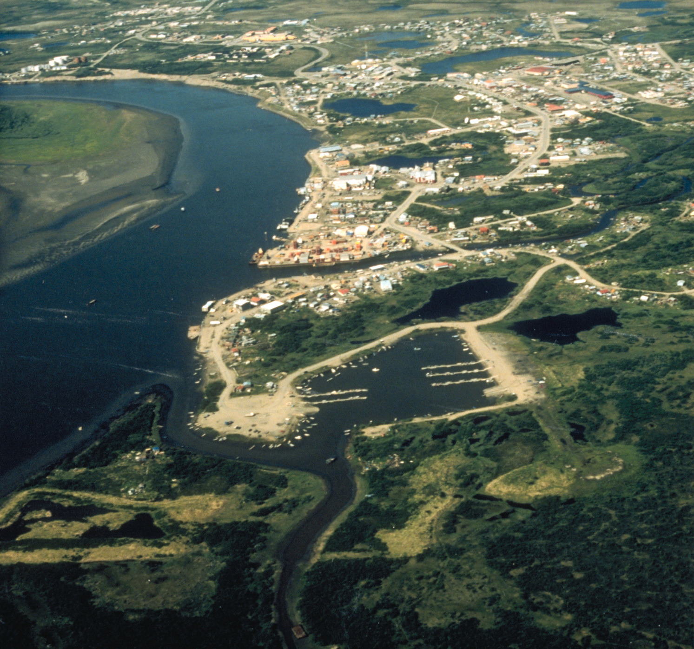

# DICKINSON CLIMATE CLASSIFICATION

# How to run the code

To run the code, open two Earth Engine Code Editor windows.

Paste the full code of the the most up to date versions, AllVersionsTogether.js and 2100AllVersionsTogether.js seperately in New Script boxes of each of the windows.

Click the "run" button.

This will generate a current climate map and a map of the climate as it is projected to be in the year 2100 given NASA's RCP8.5 "business as usual" global warming/climate change projections.

All locations on the maps are organized and color-coded according to the Dickinson Comprehensive Climate Classification System, which is explained below in this README.

Clicking on any location of the map will result in the climate classification being shown directly below the "Click map for classification" on the bottom right.

Some of these functionalities and category displays may take some time to load.

You can also filter by climate codes using the bottom right dropdown menu.

A graph to the top right displays selected cities, organized by climate classification.

Anyone with a basic knowledge of programming could make their own versions of the code by editing to add more cities to the cityList that is displayed in this graph.

As of this writing, the cityList begins on line 411 of 2100AllVersionsTogether.js and line 372 of AllVersionsTogether.js.

Keep in mind that due to the limitations of the resolution of the data, some small remote islands and/or extremely mountainous areas may not be exactly rendered according to their true classification.

If a different range of years are desired, some simple editing of the first couple lines of the code will generate those years instead, if they are included in the NASA/NEX-GDDP or ECMWF/ERA5 datasets.

# The Dickinson Climate Classification explained

This is a new climate classification inspired by the Koppen system.

It is generally more granular and includes more edge cases than the Koppen system.

This method produces hundreds of possible climates; many of which are hypothetical.

This system has the advantage of the ability to accuratly describe hypothetical climates which may occur in the future due to climate change.

This could be useful in the future as humans continue to warm the earth with fossil fuels.

This system, being more generally more granular in many ways than the Koppen, better illustrates the differences between each of the new extreme climates we will see in the future.

This could even have importance in determining habitability in high emissions (business as usual) warming scenarios.

This system also, because of its edge cases, illustrates some intresting climate factors that may not be obvious on the Koppen.

Each climate is measured with 3 letters.

The first letter measures climate zones by measuring the average temperature of the coldest month in Celsius.

X = Uninhabitable. 40+ (hypothetical)

Z = Ultratropical. 30 - 40 (hypothetical)

A = Supertropical. 20 - 30

B = Tropical. 10 - 20

C = Subtropical. 0 - 10

D = Temperate. -10 - 0

E = Continental. -20 - -10

F = Subarctic. -30 - -20

G = Arctic. -40 - -30

Y = Superarctic. Below -40

The second letter measures aridity zones.

Aridity zones are measured using evapotraspiration, and thresholds had to be manually adjusted to match the boundaries of vegetation zones.

In the future, a more scientifically and specifically defined aridity calculation may be available. 

In the meantime, further information on the specifics of the aridity calculations may be found my examining my code and figuring out how it works.

In my system, the lettering of the aridity zones is as follows:

H = Humid

G = Semihumid

M = Meditterranean (If not arid desert and if < 35% of percipitation falls in the warm half of the year)

W = Monsoon (If not arid desert and if ≥ 80% of percipitation falls in the warm half of the year)

S = Semiarid

D = Arid Desert

The differences in ratios between mediterranean and monsoon may seem strange until you consider that evaporation rates are higher in the warmer months, therefore, the reason for a difference between these ratios (and their corresponding vegetation zones) is intuitive if you really think about it.

It is possible that aridity zone ratios may be further refined in the future; a more scientific examination of vegatation may require fine tuning.

On the other hand, climate zones and zummer zones are unlikely to be changed in the future; due to their root in Celsius and thus their categorizations being simple and intuitive percentages of the difference between the freezing and boiling temperatures of water.

Aridity does not appear to be relevant to the classification of climates that fall withiin subarctic, arctic, superarctic, cold summer, very cold summer, freezing summer, or frigid summer zones.

Climate classifications that fall within these zones are not measured by aridity.

The third letter measures the severity of the summers by measuring the average temperature of the warmest month in Celsius.

X1, X2, X3,... et cetera = Extreme Hyperthermal Summer. 40+ (X3 and above are hypothetical climates)

Z2 = Hyperthermal Summer. 35 - 40

Z1 = Scorching Hot Summer. 30 - 35

A2 = Very Hot Summer. 25 - 30

A1 = Hot Summer. 20 - 25

B2 = Mild Summer. 15 - 20

B1 = Cold summer. 10 - 15

C2 = Very Cold Summer. 5 - 10

C1 = Freezing Summer. 0 - 5

Y = Frigid Summer. Below 0

Programmers and others are encouraged to find uses for this system and to make their own software programs, visualisations, or spin offs of this one based on the Dickinson Climate Classification, as long as Caleb Dickinson is acknowledged as the creater of this system and the system is appropriately titled the Dickinson Climate Classification.

# Here are some examples of these zones.

# Ultratropical Climates (Z):

### Ultratropical Scorching Hot Summer climates (Z-Z1):

Ultratropical Humid Scorching Hot Summer: (ZHZ1):  

# Supertropical Climates (A):

### Supertropical Extreme Hyperthermal Summer climates (A-X1):

Supertropical Semihumid Extreme Hyperthermal Summer (AGX1):  

Supertropical Monsoon Extreme Hyperthermal Summer (AWX1):  

Supertropical Semiarid Extreme Hyperthermal Summer (ASX1):  

### Supertropical Hyperthermal Summer climates (A-Z2):

Supertropical Humid Hyperthermal Summer (AHZ2):  

Supertropical Semihumid Hyperthermal Summer (AGZ2):  

Supertropical Monsoon Hyperthermal Summer (AWZ2):  

Supertropical Semiarid Hyperthermal Summer (ASZ2):  

Supertropical Arid Desert Hyperthermal Summer (ADZ2):  

### Supertropical Scorching Hot Summer climates (A-Z1):

Supertropical Humid Scorching Hot Summer (AHZ1):  

Supertropical Semihumid Scorching Hot Summer (AGZ1):  

Supertropical Monsoon Scorching Hot Summer (AWZ1):  

Supertropical Semiarid Scorching Hot Summer (ASZ1):  

Supertropical Arid Desert Scorching Hot Summer (ADZ1):  

### Supertropial Very Hot Summer climates (A-A2):

Supertropical Humid Very Hot Summer (AHA2):  

Supertropical Semihumid Very Hot Summer (AGA2):  

Supertropical Monsoon Very Hot Summer (AWA2):  

Supertropical Semiarid Very Hot Summer (ASA2):  

Supertropical Arid Desert Very Hot Summer (ADA2):  

### Supertropial Hot Summer climates (A-A1):

Supertropical Semihumid Hot Summer (AGA1):  

Supertropical Monsoon Hot Summer (AWA1):  

# Tropical Climates (B):

### Tropical Extreme Hyperthermal Summer climates (B-X1):  

Tropical Monsoon Extreme Hyperthermal Summer (BWX1):  

Tropical Semiarid Extreme Hyperthermal Summer (BSX1):  

Tropical Arid Desert Extreme Hyperthermal Summer (BDX1):  

### Tropical Hyperthermal Summer climates (B-Z2):

Tropical Semihumid Hyperthermal Summer (BGZ2):  

Tropical Monsoon Hyperthermal Summer (BWZ2):  

Tropical Semiarid Hyperthermal Summer (BSZ2):  

Tropical Arid Desert Hyperthermal Summer (BDZ2):  

### Tropical Scorching Hot Summer climates (B-Z1):

Tropical Humid Scorching Hot Summer (BHZ1):  

Tropical Semihumid Scorching Hot Summer (BGZ1):  

Tropical Monsoon Scorching Hot Summer (BWZ1):  

Tropical Mediterranean Scorching Hot Summer (BMZ1):   

Tropical Desert Scorching Hot Summer (BDZ1):  

### Tropical Very Hot Summer Climates (B-A2):

Tropical Humid Very Hot Summer (BHA2):  

Tropical Semihumid Very Hot Summer (BGA2):  

Tropical Monsoon Very Hot Summer (BWA2):  

Tropical Mediterranean Very Hot Summer (BMA2):  

Tropical Semiarid Very Hot Summer (BSA2):  

Tropical Arid Desert Very Hot Summer (BDA2):

  

### Tropical Hot Summer Climates (B-A1):

Tropical Humid Hot Summer (BHA1):  

Tropical Semihumid Hot Summer (BGA1):  

Tropical Monsoon Hot Summer (BWA1):  

Tropical Mediterranean Hot Summer (BMA1):  

Tropical Semiarid Hot Summer (BSA1):  

Tropical Arid Desert Hot Summer (BDA1):  

### Tropical Mild Summer Climates (B-B2):

Tropical Humid Mild Summer (BHB2):  

Tropical Semihumid Mild Summer (BGB2):  

Tropical Monsoon Mild Summer (BWB2):  

### Tropical Cold Summer Climate (BB1):  
Quito, Ecuador (today)  
Sucre, Bolivia (today)

# Subtropical Climates (C):

### Subtropical Extreme Hyperthermal Summer Climates (C-X1):

Subtropical Semihumid Extreme Hyperthermal Summer (CGX1):  

Subtropical Monsoon Extreme Hyperthermal Summer (CWX1):  

Subtropical Mediterranean Extreme Hyperthermal Summer (CMX1):  

Subtropical Semiarid Extreme Hyperthermal Summer (CSX1):  

Subtropical Desert Wasteland (CDX1):  

### Subtropical Hyperthermal Summer Climates (C-Z2):

Subtropical Humid Hyperthermal Summer (CHZ2):  

Subtropical Semihumid Hyperthermal Summer (CGZ2):  

Subtropical Mediterranean Hyperthermal Summer (CMZ2):  

Subtropical Monsoon Hyperthermal Summer (CWZ2):  

Subtropical Semiarid Hyperthermal Summer (CSZ2):  

Subtropical Desert Hyperthermal Summer (CDZ2):  

### Subtropical Scorching Hot Summer Climates (C-Z1):

Subtropical Humid Scorching Hot Summer (CHZ1):  

Subtropical Semihumid Scorching Hot Summer (CGZ1):  

Subtropical Monsoon Scorching Hot Summer (CWZ1):  

Subtropical Meiterranean Scorching Hot Summer (CMZ1):  

Subtropical Semiarid Scorching Hot Summer (CSZ1):   

Subtropical Desert Scorching Hot Summer (CDZ1):  

### Subtropical Very Hot Summer Climates (C-A2):

Subtropical Semihumid Very Hot Summer (CGA2):   

Subtropical Monsoon Very Hot Summer (CWA2):  

Subtropical Mediterranean Very Hot Summer (CMA2):   

Subtropical Semiarid Very Hot Summer (CSA2):  

Subtropical Arid Desert Very Hot Summer (CDA2):  

### Subtropical Hot Summer Climates (C-A1):  

Subtropical Humid Hot Summer (CHA1):  

Subtropical Semihumid Hot Summer (CGA1):   

Subtropical Meiterranean Hot Summer (CMA1):  

Subtropical Arid Desert Hot Summer (CDA1):  

### Subtropical Mild Summer Climates (C-B2):

Subtropical Humid Mild Summer (CHB2):  

Subtropical Semihumid Mild Summer (CGB2):  

Subtropical Mediterranean Mild Summer (CMB2):  

### Subtropical Cold Summer Climate (CB1):  
Ketchikan, AK (today)  
Stanley, Falkland Islands (UK) (today)  
Tórshavn, Faroe Islands (DK) (today)  
Stanley, Falkland Islands (UK) (2100)  
Tórshavn, Faroe Islands (DK) (2100)  
Reykjavík, Iceland  (2100)  
Ushuaia, Argentina (2100)

### Subtropical Very Cold Summer Climate (CC2):  

Adak, AK (today)  
Macquarie Island Research Station (today)  
Macquarie Island Research Station (2100)  
Bird Island Research Station (2100)

# Temperate Climates (D):

### Temperate Wasteland Climates (D-X1):

Temperate Semiarid Extreme Hyperthermal Summer (DSX1):  

Temperate Arid Desert Extreme Hyperthermal Summer (DDX1):  

### Temperate Hyperthermal Summer Climates (D-Z2):  

Temperate Humid Hyperthermal Summer (DHZ2):  

Temperate Semihumid Hyperthermal Summer (DGZ2):  

Temperate Monsoon Hyperthermal Summer (DWZ2):  

Temperate Mediterranean Hyperthermal Summer (DMZ2):  

Temperate Semiarid Hyperthermal Summer (DSZ2):  

Temperate Arid Desert Hyperthermal Summer (DDZ2):  

### Temperate Scorching Hot Summer Climates (D-Z1):

Temperate Humid Scorching Hot Summer (DHZ1):  

Temperate Semihumid Scorching Hot Summer (DGZ1):  

Temperate Monsoon Scorching Hot Summer (DWZ1):  

Temperate Mediterranean Scorching Hot Summer (DMZ1):  

Temperate Semiarid Scorching Hot Summer (DSZ1):  

Temperate Arid Desert Scorching Hot Summer (DDZ1):  

### Temperate Very Hot Summer Climates (D-A2):

Temperate Humid Very Hot Summer (DHA2):  

Temperate Semihumid Very Hot Summer (DGA2):  

Temperate Monsoon Very Hot Summer (DWA2):  

Temperate Semiarid Very Hot Summer (DSA2):  

Temperate Arid Desert Very Hot Summer (DDA2):  

### Temperate Hot Summer Climates (D-A1):

Temperate Humid Hot Summer (DHA1):  

Temperate Semihumid Hot Summer (DGA1):  

Temperate Monsoon Hot Summer (DWA1):  

Temperate Mediterranean Hot Summer (DMA1):  

Temperate Semiarid Hot Summer (DSA1): 

### Temperate Mild Summer Climates (D-B2):

Temperate Humid Mild Summer (DHB2):  

Temperate Semihumid Mild Summer (DGB2):  

Temperate Mediterranean Mild Summer (DMB2):  

Temperate Semiarid Mild Summer (DSB2):  

### Temperate Cold Summer Climate (DB1):  
Anchorage, AK (today)  
Thimphu, Bhutan (today)  
Reykjavík, Iceland (today)  
Kalifornsky, AK (today)  
Sitka, AK (today)  
Kenai, AK (today)  
Sterling, AK (today)  
Wainwright, AK (2100)

### Temperate Very Cold Summer Climate (DC2):  
Juneau, AK (today)  
Ushuaia, Argentina (today)  
Nuuk, Greenland (DK) (2100)  
Longyearbyen, Svalbard & Jan Mayen (NO) (2100)  

### Temperate Freezing Summer Climate (DC1):  
Bird Island Research Station (today)  
Primavera Research Station, Antarctica (2100)

### Temperate Frigid Summer Climate (DY):  
Primavera Research Station, Antarctica (today)

# Continental Climates (E):

### Continental Hot Summer Climates (E-A1):

Continental Humid Hot Summer (EHA1):  

### Continental Mild Summer Climates (E-B2):  

Continental Humid Mild Summer (EHB2):  

Continental Semihumid Mild Summer (EGB2):  

Continental Monsoon Mild Summer (EWB2):   

Continental Semiarid Mild Summer (ESB2):   

### Continental Cold Summer Climate (EB1):  
BETHEL IN SUMMER

BETHEL IN WINTER

Meadow Lakes, AK (today)  
Bethel, AK (today)  
North Lakes, AK	(today)  
Wasilla, AK	(today)  
Tanaina, AK	(today)  
Palmer, AK	(today)  
Gateway, AK	(today)  
Iqaluit, NU (2100)  
Igloolik, NU (2100)  
Qikiqtarjuaq, NU (2100)  
Utqiagvik, AK (2100)

### Continental Very Cold Summer Climate (EC2):  
NUUK IN JUNE

Nuuk, Greenland (DK) (today)  
Longyearbyen, Svalbard & Jan Mayen (NO) (today)  
Pangnirtung, NU (2100)

### Continental Freezing Summer Climate (EC1):  

Davis Research Station, Antarctica (today)  
Davis Research Station, Antarctica (2100)  
Casey Research Station, Antarctica (2100)

### Continental Frigid Summer Climate (EY):  

Casey Research Station, Antarctica (today)

# Subarctic Climates (F):

### Subarctic Very Hot Summer Climate (FA2):  
Yakutsk, Russia (2100)

### Subarctic Hot Summer Climate (FA1):  

### Subarctic Mild Summer Climate (FB2):  

Ulaanbaatar, Mongolia (today)  
Thompson, MB (today)  
Yellowknife, NT	(today)  
Hay River, NT	(today)  
Fort Smith, NT	(today)  
Behchoko, NT	(today)  
Fort Simpson, NT	(today)  
Fort Providence, NT	(today)  
Norman Wells, NT	(today)  
Fort Good Hope, NT	(today)  
Baker Lake, NU (2100)

### Subarctic Cold Summer Climate (FB1):  

Inuvik, NT (today)   
Arviat, NU (today)  
Cambridge Bay, NU (2100)

### Subarctic Very Cold Summer Climate (FC2):  
PRODHOE BAY IN JULY

Tuktoyaktuk, NT (today)  
Iqaluit, NU (today)  
Pangnirtung, NU (today)     
Prudhoe Bay, AK (today)  
Eureka Research Station, NU (2100)  
Isachsen Research Station, NU (2100)

### Subarctic Freezing Summer Climate (FC1):  
POND INLET IN JUNE  

Qikiqtarjuaq, NU (today)  
Wainwright, AK (today)  
Utqiagvik, AK (today)  
Pond Inlet, NU (today)  
Pond Inlet, NU (2100)  
McMurdo Research Station, Antarctica (2100)

### Subarctic Frigid Summer Climate (FY):  

McMurdo Research Station, Antarctica (today)

# Arctic Climates (G): 

### Arctic Mild Summer Climate (GB2):  

Yakutsk, Russia (today)

### Arctic Cold Summer Climate (GB1):  
  

Rankin Inlet, NU (today)  
Baker Lake, NU (today)  
Coral Harbour, NU (today)

### Arctic Very Cold Summer Climate (GC2):  

Cambridge Bay, NU (today)  
Igloolik, NU (today)  
Eureka Research Station, NU (today)

### Arctic Freezing Summer Climate (GC1):  

Isachsen Research Station, NU (today)

### Arctic Frigid Summer Climate (GY):  

# Superarctic Climates (Y):

### Superarctic Very Cold Summer Climate (YC2):  
Concordia Research Station, Antarctica (2100)

### Superarctic Freezing Summer Climate (YC1):  

### Superarctic Frigid Summer Climate (YY):  

Concordia Research Station, Antarctica (today)

